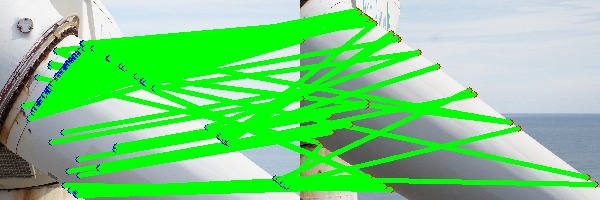
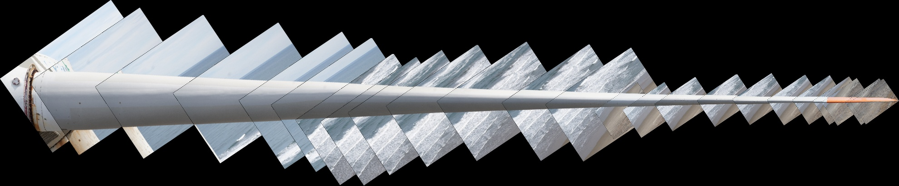
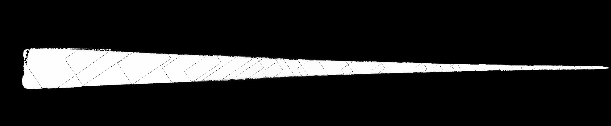
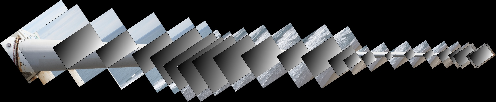
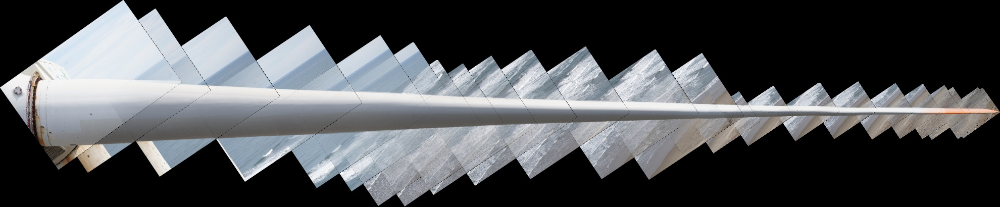

# image stitching for drone-based wind turbine blade inspection

This repository reproduces the paper "Towards accurate image stitching for drone-based wind turbine blade inspection"

The repository code is implemented based on python and does not require configuring too many dependency environments.The following pictures show the process of image stitching. You can apply the code to your wind turbine blades step by step based on these results.

* Extract feature points and match them, but the effect is not very good, a large number of feature points fall on the edge of the blade.

* Use one picture to cover another picture according to the distance, and align the straight lines of the edge of the blade to roughly stitch the images.

* Fine-tune the rough stitching results to obtain the final stitching effect and generate the corresponding mask.

* Fusion of the stitching results to generate a gradient weight image in the intersection area of the two images.

* Fusion of images in pairs to obtain the final panoramic stitching result.

**Notice**
1.You must rely on camera-blade distance to design the scale of the image, other methods are unreliable.

2.The method of feature points is poor, but if you know the camera-blade distance and the internal and external parameters of the camera, maybe you can rely on fake feature points to initialize your affine transformation matrix in pairs.

3.You can refer to the method in this paper to fuse and remove the black edges in fusion stage.

**Thanks**

Cong Yang, Soochow University
Xun Liu, Clobotics